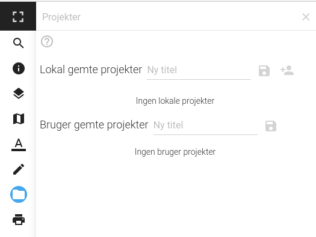

# Projekter

Projekt-modulet gør det muligt at gemme tilstanden af Vidi på serveren. Derved kan en given tilstand gendannes. Et projekt gemmes under et selvvalgt navn.

Projekter kan gemmes på to måder: Lokalt eller under en brugerprofil.

## Lokal gemte projekter

## Bruger gemte projekter